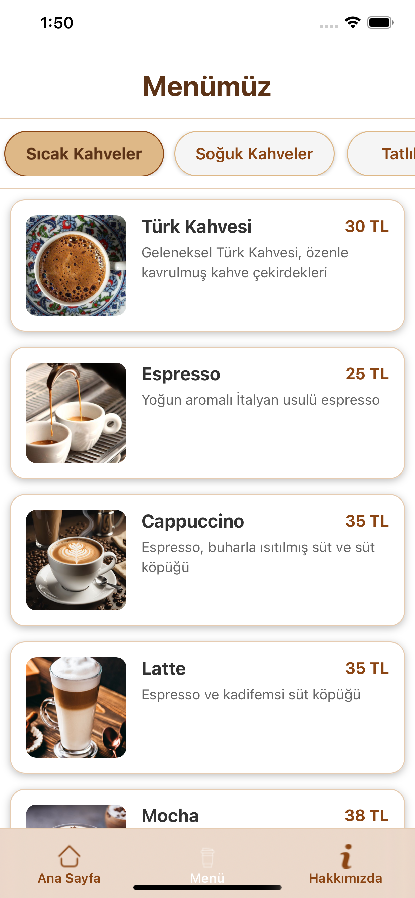
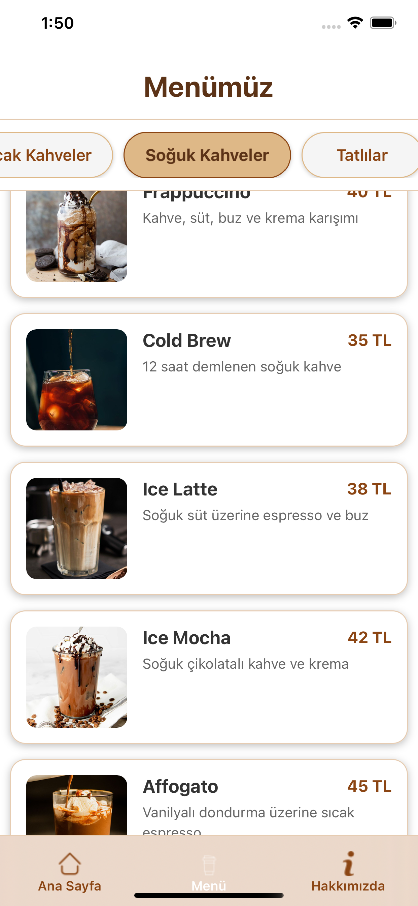
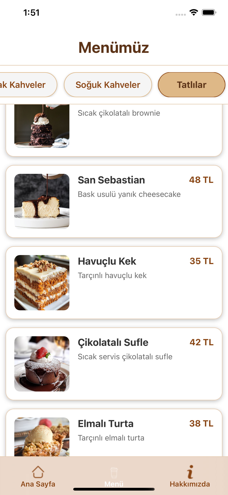
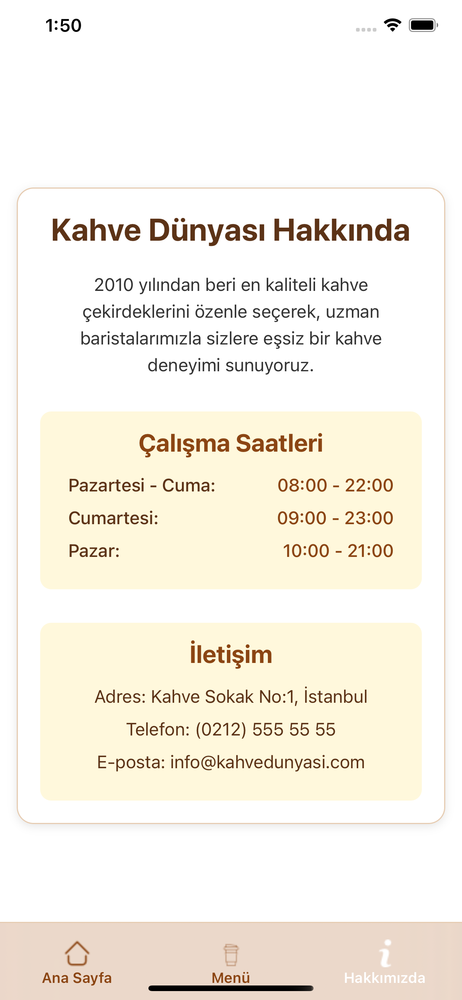

# CoffeeMenu/ReactNative

## Uygulama Ekranları

 
## Kullanılan Teknolojiler

- **Formik** – Form yönetimi için kullanıldı.
- **Yup** – Form verilerini doğrulamak (validation) için kullanıldı.
- **react-i18next** – Uygulamada çoklu dil desteği sağlamak için kullanıldı.
- **Axios** – API isteklerini gerçekleştirmek için kullanıldı.

  
## İletişim
- ozturkkensar@gmail.com
- https://github.com/EnsarOzturk
- www.linkedin.com/in/ensar-öztürk-3aa986235
